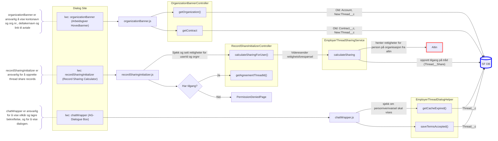

```mermaid
flowchart LR

subgraph site["Dialog Site"]
direction TB
lwcorganizationBanner["lwc: organizationBanner (Arbeidsgiver Hovedbanner)"]
lwcrecordSharingInitializer["lwc: recordSharingInitializer (Record Sharing Calculator)"]
lwcchatWrapper["lwc: chatWrapper (AG- Dialogue Box)"]
end

organizationBanner["organizationBanner.js"]
recordSharingInitializer["recordSharingInitializer.js"]
chatWrapper["chatWrapper.js"]

altin["Altin"]
sfdb@{ shape: cyl, label: "SF DB" }

subgraph OrganizationBannerController
getOrganization["getOrganization()"]
getContract["getContract"]
end

subgraph EmployerThreadDialogHelper
getCacheExpired["getCacheExpired()"]
saveTermsAccepted["saveTermsAccepted()"]
end

subgraph RecordShareInitializerController
calculateSharingForUser["calculateSharingForUser()"]
getAgreementThreadId["getAgreementThreadId()"]
end

subgraph EmployerThreadSharingService
calculateSharing["calculateSharing"]
end


A@{ shape: brace-r, label: "organizationBanner er ansvarlig å vise kontonavn og org.nr., deltakernavn og link til avtale"}-.-lwcorganizationBanner-->organizationBanner-->getOrganization----->|Old: Account, New:Thread__c|sfdb
organizationBanner-->getContract-->|Old: Contract__c, New:Thread__c|sfdb

B@{ shape: brace-r, label: "recordSharingInitializer er ansvarlig for å opprette thread share records" }-.-lwcrecordSharingInitializer
lwcrecordSharingInitializer-->recordSharingInitializer-->|Sjekk og sett rettigheter for userId og orgnr|calculateSharingForUser
calculateSharingForUser-->|Videresender rettighetsforespørsel|calculateSharing-->|henter rettigheter for person på organisasjon fra altin|altin
calculateSharing-->|"opprett tilgang på tråd (Thread__Share)"|sfdb
recordSharingInitializer-->calculateSharingOk{Har tilgang?}-->|Ja|getAgreementThreadId
calculateSharingOk{Har tilgang?}-->|Nei|PermissionDeniedPage


C@{ shape: brace-r, label: "chatWrapper er ansvarlig for å vise vilkår og lagre bekreftelse, og for å vise dialogen."}-.-lwcchatWrapper-->chatWrapper-->|sjekk om persornvernvarsel skal vises|getCacheExpired-->|Thread__c|sfdb
chatWrapper-->saveTermsAccepted-->|Thread__c|sfdb

style altin stroke:#f66,stroke-width:4px
style sfdb stroke:#00f,stroke-width:4px


```
