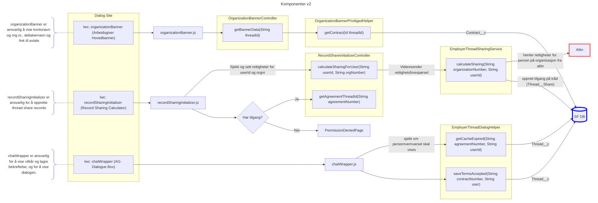

```mermaid
---
title: Komponenter v2
---
flowchart LR
subgraph site["Dialog Site"]
direction TB
lwcorganizationBanner["lwc: organizationBanner (Arbeidsgiver Hovedbanner)"]
lwcrecordSharingInitializer["lwc: recordSharingInitializer (Record Sharing Calculator)"]
lwcchatWrapper["lwc: chatWrapper (AG- Dialogue Box)"]
end

organizationBanner["organizationBanner.js"]
recordSharingInitializer["recordSharingInitializer.js"]
chatWrapper["chatWrapper.js"]

altin["Altin"]
sfdb@{ shape: cyl, label: "SF DB" }


subgraph OrganizationBannerController
getBannerData["getBannerData(String threadId)"]
end

subgraph EmployerThreadDialogHelper
getCacheExpired["getCacheExpired(String agreementNumber, String userId)"]
saveTermsAccepted["saveTermsAccepted(String contractNumber, String user)"]
end

subgraph RecordShareInitializerController
calculateSharingForUser["calculateSharingForUser(String userId, String orgNumber)"]
getAgreementThreadId["getAgreementThreadId(String agreementNumber)"]
end


subgraph OrganizationBannerPriviligedHelper
getContract["getContract(Id threadId)"]
end
subgraph EmployerThreadSharingService
calculateSharing["calculateSharing(String organizationNumber, String userId)"]
end


A@{ shape: brace-r, label: "organizationBanner er ansvarlig å vise kontonavn og org.nr., deltakernavn og link til avtale"}-.-lwcorganizationBanner-->organizationBanner-->getBannerData-->getContract-->|Contract__c|sfdb

B@{ shape: brace-r, label: "recordSharingInitializer er ansvarlig for å opprette thread share records" }-.-lwcrecordSharingInitializer
lwcrecordSharingInitializer-->recordSharingInitializer-->|Sjekk og sett rettigheter for userId og orgnr|calculateSharingForUser
calculateSharingForUser-->|Videresender rettighetsforespørsel|calculateSharing-->|henter rettigheter for person på organisasjon fra altin|altin
calculateSharing-->|"opprett tilgang på tråd (Thread__Share)"|sfdb
recordSharingInitializer-->calculateSharingOk{Har tilgang?}-->|Ja|getAgreementThreadId
calculateSharingOk{Har tilgang?}-->|Nei|PermissionDeniedPage

C@{ shape: brace-r, label: "chatWrapper er ansvarlig for å vise vilkår og lagre bekreftelse, og for å vise dialogen."}-.-lwcchatWrapper-->chatWrapper-->|sjekk om persornvernvarsel skal vises|getCacheExpired-->|Thread__c|sfdb
chatWrapper-->saveTermsAccepted-->|Thread__c|sfdb

style altin stroke:#f66,stroke-width:4px
style sfdb stroke:#00f,stroke-width:4px

```
